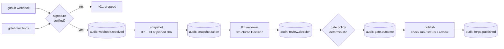
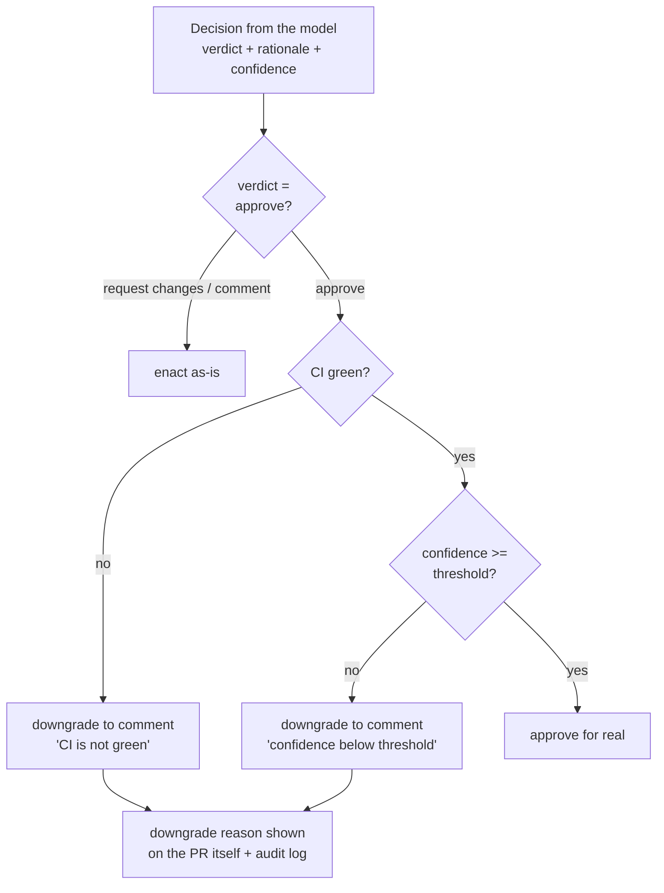

# sluss

sluss (swedish: *canal lock*) — a gate for pull requests. a PR sails in, gets inspected, and the gate either opens or stays shut. every step of that leaves a trace.

## what it is

a bot that works through PRs and MRs so you don't have to babysit them:

- reads the diff, the description, the discussion
- checks what CI/tests say
- decides: approve, request changes, or just comment
- posts line-level annotations where it has something to say
- and the whole point: **every action is traceable**. who decided what, based on which commit, with what rationale, at what confidence — all of it queryable after the fact

github and gitlab both, since work lives in both places.

## the one rule

**the model proposes, the gate disposes.**

the LLM never touches the forge directly. it produces a structured `Decision` (verdict + rationale + annotations + confidence). that decision goes into the audit log *first*, verbatim. then a deterministic, unit-tested `GatePolicy` — plain rust, no model in the loop — decides what actually gets enacted. red CI? approval downgraded to a comment. confidence too low? downgraded, with the reason recorded. you can read the gate in one sitting and test it like any other function.



## traceability

three layers, so "why did the bot approve #42?" is always answerable:

1. **append-only event log** — sqlite, and the schema itself refuses UPDATE and DELETE (triggers raise). webhook received, snapshot taken, decision proposed, gate outcome, action posted — one row each, never rewritten. re-reviewing appends, nothing is overwritten (stolen with pride from pr-inbox)
2. **check runs as the public record** — on github every outcome becomes a check run pinned to the exact head commit, with summary, rationale and annotations in the diff. branch protection turns that check into the actual merge gate. gitlab gets the same via external status checks + approvals api
3. sqlite is the long-term copy — github archives check data after ~400 days, our log doesn't expire

how a verdict travels through the gate:



## layout

```
crates/
  sluss-core     domain types + the deterministic gate
  sluss-audit    append-only sqlite store, with read-back queries
  sluss-github   octocrab-based: snapshot PRs, publish check runs + reviews
  sluss-gitlab   hand-written webhook payloads + small REST client: snapshot MRs, publish status/note/approval
  sluss-llm      genai-based reviewer: structured Decision out of any provider (anthropic, openai, ollama, ...)
  sluss          the daemon (axum webhook receiver + pipeline) and the `sluss log` reader
```

## status

the whole loop is implemented and unit-tested; what it hasn't had yet is a production shakedown against real forges:

- [x] webhook receiver with signature verification (github hmac, gitlab token, constant-time)
- [x] every verified webhook lands in the audit log before anything else happens
- [x] the gate, with tests
- [x] github snapshot: PR title/body/diff + CI state at the pinned head sha (refuses to proceed if the branch moved; a repo with no CI at all counts as *not green*)
- [x] github publish: check run with annotations (worst-first, capped at github's 50) + matching review. downgrades are visible on the PR itself, not just in the log
- [x] reviewer: genai call with json-schema structured output; the model never gets to claim what model it is, and PR content is treated as data, not instructions
- [x] gitlab snapshot/publish: MR meta + stitched diffs + latest-pipeline state; commit status as the gate (comment-only verdicts post *no* status), note with rationale, approve/unapprove pinned to the sha
- [x] pipeline wired: webhook -> snapshot -> review -> gate -> publish, one audit event appended *before* each next step, errors audited too
- [x] `sluss log [repo [number]]` — replay any decision from the append-only store
- [x] github app auth: JWT client scoped per repo installation (ids cached), so check runs — the real gate — actually land. token auth still works as the degraded fallback, with a startup warning
- [ ] line-anchored gitlab discussions (annotations render in the note for now)
- [ ] re-review debounce + concurrency cap per repo
- [ ] a `sluss log <repo> <nr>` command to read the audit trail

## running

```
# webhook verification
export SLUSS_GITHUB_WEBHOOK_SECRET=...   # from your github app
export SLUSS_GITLAB_WEBHOOK_TOKEN=...    # from your gitlab webhook config

# forge access (either or both; missing one just disables that side)
# github: app credentials make the gate real (check runs are app-only on
# github's side). register an app with checks:write + pull_requests:write,
# install it on your repos, and:
export SLUSS_GITHUB_APP_ID=...
export SLUSS_GITHUB_APP_KEY_PATH=/path/to/app-private-key.pem
# ...or fall back to a personal token (snapshot + reviews work, check runs
# get rejected by github — sluss warns about this at startup):
export SLUSS_GITHUB_TOKEN=...
export SLUSS_GITLAB_TOKEN=...
export SLUSS_GITLAB_URL=https://gitlab.com   # default; point at your own instance

# the reviewer (genai picks the provider from the model name + its api key env)
export ANTHROPIC_API_KEY=...
export SLUSS_MODEL=claude-sonnet-5       # default; set to `off` to only audit webhooks

# the gate
export SLUSS_MIN_CONFIDENCE=0.8          # default
export SLUSS_REQUIRE_CI_GREEN=true       # default

export SLUSS_DB=...                      # default: ~/.local/share/sluss/sluss.db
export SLUSS_ADDR=127.0.0.1:8907         # default

cargo run -p sluss             # = sluss serve
sluss log                      # tail the audit trail
sluss log morgan/demo 42       # every event for one PR/MR
```

point a github app (pull_request + check_suite events) or a gitlab webhook (merge request events) at `/webhook/github` or `/webhook/gitlab`.

## why not just use an existing tool

[pr-agent](https://github.com/qodo-ai/pr-agent) is good and covers the review-and-comment part on both forges — if that's all you need, use that. but it deliberately won't approve autonomously, and its trace is basically "the comments it left". the combination of *real approve/block power* and *a proper audit trail* didn't exist, so: sluss.
