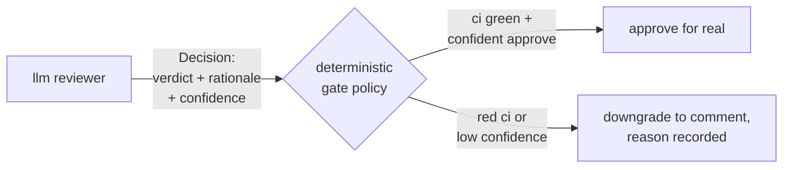
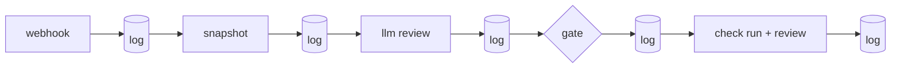

# sluss: a merge gate you can audit

*2026-07-06*

every ai code-review tool can leave comments. almost none of them will put
their name on an approval — and none of the ones that do can show you,
six months later, exactly why they approved PR #442 at commit `57e08a8`.

sluss (swedish: *canal lock*) is a small rust daemon that does both: it
reviews pull requests and merge requests with an llm, it can genuinely
approve or block the merge, and every single step it takes is written to an
append-only log before the next step runs. the name is the design: a boat
doesn't get through a sluss because the water feels good about it. the gate
measures, the gate records, the gate opens.

## the one rule

the model proposes, the gate disposes.



the llm never touches the forge. it produces a structured decision —
verdict, rationale, line annotations, and its honest confidence. that
decision is written to the audit log *verbatim* before anything else
happens. then a deterministic gate — plain rust, unit-tested, readable in
one sitting — decides what actually gets enacted. red ci? the approval
becomes a comment, and the downgrade reason is posted on the pr itself, not
buried in a log. the bot hedging in public beats the bot bluffing in
private.

## every action, traceable



the audit store is sqlite with a twist: the schema itself refuses UPDATE
and DELETE (triggers abort). re-reviews append. errors append. even "i
couldn't proceed because the token is missing" appends. asking "why did the
bot do that?" is one command:

```
$ sluss log mwigge/smedja 87
#12  13:26:18  webhook.received.pull_request  mwigge/smedja#87 @d021336b
#13  13:26:18  pipeline.started               {"model":"MiniMax-M2"}
#14  13:26:20  snapshot.taken                 ci: 0/1 checks green, failed: fmt · clippy · test
#19  13:28:29  review.decision                request_changes (0.95) — CI checks are failing
#20  13:28:29  gate.outcome                   enact -> request_changes
#21  13:28:31  forge.published                check run 85383471027 + CHANGES_REQUESTED review
```

that's a real trail from the first pr sluss ever gated. the check run is
pinned to the exact commit; github's branch protection turns it into the
actual merge gate. and because github archives check data after ~400 days,
the sqlite log is the copy that never expires.

it cuts both ways: sluss also records what the humans do next. merging a pr
the bot wanted changed becomes a `human.override` event — over time the log
turns into a dataset of where the bot and the team disagree.

## watching it run

`sluss dash` is a terminal dashboard over the same log — decisions per
repo, verdict breakdown, pipeline latency, and a velocity/value panel:

```
┌ velocity & value ────────────────────┐
│ velocity     0.9 decisions/day (7d)  │
│ avg conf     0.68                    │
│ p50 / p95    13.2s / 21.4s           │
│ value        2.1 pts (391 pts/h)     │
└──────────────────────────────────────┘
```

"value" is a documented heuristic, not vibes: decisive verdicts earn their
confidence in points, comments earn a fraction, and the rate divides by
pipeline time actually spent. a bot that produces fast, confident, decisive
reviews scores; one that slowly hedges doesn't.

## honest lessons from the first day

sluss reviewed its first real prs the same day the gate went live, and the
audit log kept receipts on everything that went wrong on the way:

- a 318-file pr blew github's 300-file diff-endpoint limit → fallback to
  stitching per-file patches
- the model ignored the structured-output spec and answered in markdown →
  explicit json shape in the prompt plus one corrective retry
- on a 3.2 MB diff the model came back with *comment, confidence 0.4,
  "cannot fully assess — the diff is truncated"* — which is exactly the
  behavior you want from something with merge authority: low confidence,
  disclosed limits, no bluff

every one of those failures is still in the log, timestamped, next to the
fix's first successful run. that's the pitch, really: not that the bot is
always right, but that you can always see what it did.

## what shipping an autopilot taught the gate

sluss's decision pipeline got transplanted into a much scarier context —
[tumult](https://tumult.rs), a chaos-engineering platform where the same
propose→gate→enact pattern now decides whether to *inject faults into
running systems* autonomously. surviving that context sent three lessons
back upstream:

- **the rule trace is the audit record.** it's not enough to log what the
  gate decided — the record has to show every rule it checked, in a fixed
  order, pass or fail. sluss's gate now emits that trace with every
  outcome. an auditor shouldn't have to read source code to know what was
  evaluated.
- **the policy belongs in the record.** a verdict is only reproducible if
  the standards that produced it travel with it. every `gate.outcome`
  event now carries the full policy (confidence threshold, ci
  requirement) — and the dash shows the gate's live standards next to its
  results, read from the same audit rows, never from env. what actually
  gated a decision six months ago is in the row, not in your memory of
  what the config used to be.
- **verdicts beyond yes/no.** tumult's gate has four verdicts — including
  *downgrade*, which doesn't just refuse, it says exactly which bounded
  condition blocked autonomy. sluss already downgrades approvals to
  comments; the lesson is to keep making the *reason* a first-class,
  greppable thing rather than prose.

the two projects now form a loop: sluss proved the pipeline on pull
requests, tumult hardened it against production blast radius, and the
hardening flows back. same rule everywhere: the model (or the scorer)
proposes — a deterministic, replayable gate disposes.

## try it

rust workspace, apache/mit, github + gitlab, any llm provider genai speaks
(anthropic, openai, minimax, ollama, ...):

**https://github.com/mwigge/sluss** — the [quickstart](../QUICKSTART.md)
takes about fifteen minutes.
